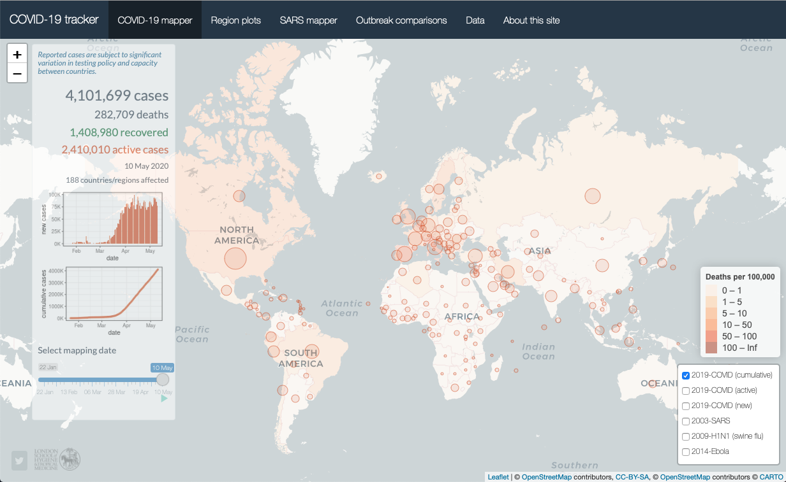

## Final Project Report (Interactive COVID-19 Data Analysis and Mapping Dashboard Using R with Shiny)

This project dashboard page contains the code and input data for the [Interactive COVID-19 Data Analysis and Mapping Dashboard Using R with Shiny](https://vac-lshtm.shinyapps.io/ncov_tracker/).

## Shiny interface

The interactive Shiny app. A screenshot of the interface is provided below.

## Code Functionality Explanation

Key elements of the analysis code are as follows:

- *jhu_data_full.R* – an R script that extracts and reformats time-series from the [Johns Hopkins Center for Systems Science and Engineering github page](https://github.com/CSSEGISandData/COVID-19/tree/master/csse_covid_19_data/csse_covid_19_time_series). The output files are saved in the *input_data* folder.
- *ny_data_us.R* – an R script that extracts and reformats time-series from the [New York Times github page](https://github.com/nytimes/covid-19-data). The output files are saved in the *input_data* folder.
- *app.R* - an R script used to render the Shiny app. This consists of several plotting functions as well as the ui (user interface) and server code required to render the Shiny app. The script has become more complex over time as a growing number of interactive features has been added.
- *input_data* - a folder containing dynamic input data relating to the evolving COVID-19 pandemic (updated by *jhu_data_full.R* and  *ny_data_us.R*) and static input data relating to past epidemics and country mapping coordinates.

##  Instruction of how to Run this Shiny App Locally

You can launch the Shiny app by running the ``app.R`` file. In RStudio, you can do this by opening app.R and clicking the Run App button. Alternatively, run the following command in R:

``shiny::runApp("app.R")``

## Exploring the Application
Once the app is running, it will open in a web browser window or in the RStudio Viewer pane. You can interact with the dashboard, visualizations, and maps as designed. like this 

## Authors

Student : Abdiwahab Mohamed Abdirashid

## Resources 

- *Input data* are obtained from the [Johns Hopkins Center for Systems Science and Engineering github page](https://github.com/CSSEGISandData/COVID-19/tree/master/csse_covid_19_data/csse_covid_19_time_series).
- *Time-series* from the [New York Times github page](https://github.com/nytimes/covid-19-data)